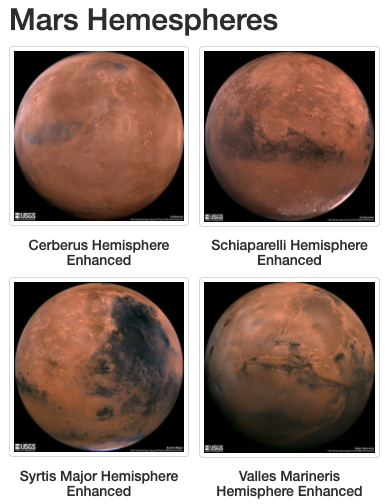
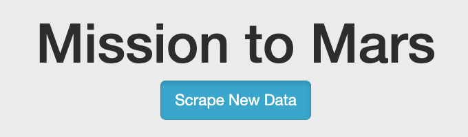
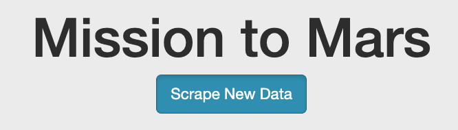

# Mission-to-Mars
Module 10 will focus on web scraping using splinter and BeautifulSoup to extract online data, use MongoDB to store data, use flask to create a web app and customize appearance using HTML elements.

### Overview:

The module challenge includes adding all four of the hemisphere images to the current web app that was created throughout the course of the modlue exercises. Both BeautifulSoup and Splinter were used to scrape full-resolution images of Mar's hemeispheres and the titles of those images, stored the scraped data on a Mongo database, used a web application to display the data, and altered the design of the web app to accommodate these images.

### Results:

The three key differences in weather between June and December are listed below:

•	*Deliverable 1: Scrape Full-Resolution Mars Hemisphere Images and Titles.*

Screen shot of the actual scraped full-resolution images and title:

• 	*Deliverable 2: Update the Web App with Mars Hemisphere Images and Titles.* 

See attached files to verify updated web app.

•	*Deliverable 3: Add Bootstrap 3 Components.*

1. Updated the web app to make it mobile-responsive.
2. Added two additional Bootstrap 3 components by changing the button styling to (1) "btn-info", (2) added "active" on the button so that it will appear pressed (with a darker background, darker border, and inset shadow) when active, and (3) changing the title and image size. 

Regular button:

Activated (pressed) button:

